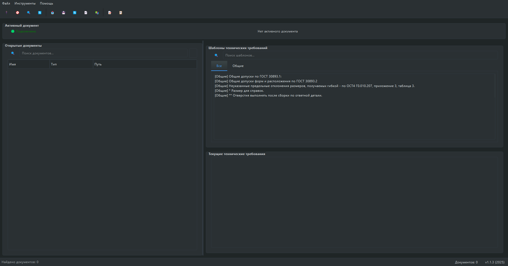

# 🛠️ Редактор технических требований KOMPAS-3D

*Интуитивный интерфейс для работы с техническими требованиями в KOMPAS-3D*

---

## 🌟 Особенности

| **Функция**               | **Описание**                                                                 |
|---------------------------|-----------------------------------------------------------------------------|
| 🖥️ **Интеграция с KOMPAS** | Автоподключение к KOMPAS-3D через COM-интерфейс.                            |
| 📄 **PDF-экспорт**         | Пакетное сохранение чертежей в PDF с автоматическим созданием подпапок.     |
| 🧩 **Шаблоны**             | Готовые текстовые блоки с фильтрацией и категориями.                        |
| 🔄 **Автообновление**      | Динамическое обновление списка документов каждую секунду.                   |
| 📋 **Автонумерация**       | Умная нумерация пунктов с поддержкой вложенности.                           |

---

## 🚀 Быстрый старт

### 📋 Требования
- **ОС**: Windows 10/11  
- **ПО**: KOMPAS-3D (API 7+)  
- **Зависимости**:  
  ```bash
  pip install PyQt6 pywin32
  ```

### ⚙️ Установка
1. 📥 Скачайте скрипт `kompas_app.py`.  
2. 🛠️ Установите зависимости:  
   ```bash
   pip install -r requirements.txt
   ```  
3. ▶️ Запустите:  
   ```bash
   python kompas_app.py
   ```

---

## 🎮 Интерфейс

*Главное окно приложения с панелями документов, редактором и шаблонами*

---

## 📌 Ключевые функции

### 📂 Работа с документами
- **Поиск документов** 🔍 — фильтрация по имени в реальном времени.  
- **PDF-экспорт** 🖨️:  
  - Одиночный файл: `Ctrl+Shift+S`  
  - Пакетный экспорт: кнопка 📚 на панели.  

### ✨ Шаблоны
- **Категории**:  
  ```python
  {
    "Общие": ["Материал: сталь", "Термообработка..."],
    "Покрытия": ["Цинкование", "Анодирование"]
  }
  ```
- **Редактирование**: Открыть JSON через `Инструменты -> Редактировать шаблоны`.

### 🛠️ Форматирование
| **Кнопка** | **Действие**       | **Горячая клавиша** |
|------------|--------------------|---------------------|
| **B**      | Жирный текст       | `Ctrl+B`            |
| *I*        | Курсив             | `Ctrl+I`            |
| _U_        | Подчеркивание      | `Ctrl+U`            |

---

## 🚨 Troubleshooting

### Распространенные ошибки
| **Проблема**               | **Решение**                                   |
|----------------------------|-----------------------------------------------|
| Нет подключения к KOMPAS   | Запустите KOMPAS-3D от имени администратора.  |
| Ошибки COM-интерфейса      | Переподключитесь через `Ctrl+K`.              |
| Шаблоны не загружаются     | Удалите `templates.json` для пересоздания.    |

---

## 📦 Сборка в EXE
```bash
pyinstaller --onefile --windowed --icon=app.ico kompas_app.py
```
- 🎯 **Иконка**: Добавьте файл `app.ico` для кастомизации.  
- 📂 Готовый EXE: в папке `dist/`.

---

## 📬 Контакты
**Поддержка**:  
[](https://t.me/HeagBoKaT)  
**Версия**: `1.1.3` | **Год**: 2025

---

<details>
<summary>📜 Полная документация</summary>

### 🔄 Периодическое обновление
- Список документов обновляется каждую 1 сек.  
- Для ручного обновления нажмите `F6`.

### ⚙️ Конфигурация
- Файл шаблонов:  
  ```bash
  ~/KOMPAS-TR/templates.json
  ```
</details>

